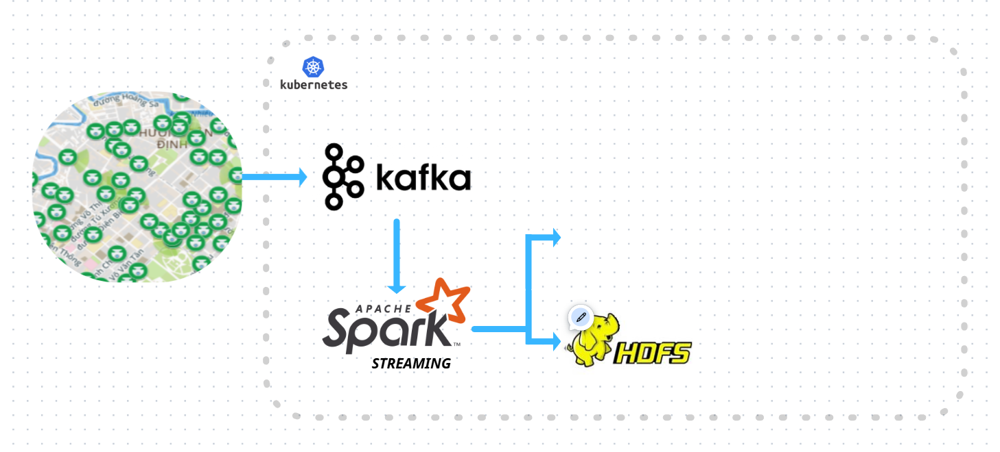

### **ʜuɠɘɗata**
> IT4931: soict - hust
---  

# Hệ thống Big Data cho Camera Giao Thông
*(Lambda-style pipeline với Kafka → HDFS → Spark Streaming & Spark Batch)*

> Mục tiêu: Xây dựng **pipeline đầu-cuối** để **thu thập – xử lý – lưu trữ – trực quan hóa** dữ liệu từ camera giao thông theo thời gian thực, từ đó tạo **insight** về ùn tắc, vi phạm làn đường, mật độ phương tiện, thời gian chờ đèn…


---

## 1) Tổng quan dự án

- **Bài toán**: Thu thập luồng video/ảnh từ camera giao thông, trích xuất **sự kiện & chỉ số** (vehicle count, speed, density, queue length, incidents), lưu trữ dài hạn, và phục vụ phân tích thời gian thực & phân tích theo lô.
- **Kiến trúc**: **Lambda**
  - **Speed layer**: Spark Structured Streaming đọc từ Kafka để phát hiện và cảnh báo thời gian thực.
  - **Batch layer**: Spark Batch chạy theo lịch từ dữ liệu gốc/làm sạch trên HDFS để tạo bảng sự kiện chuẩn hoá, huấn luyện mô hình dự đoán tắc đường.
  - **Serving**: Bảng đã tổng hợp (Parquet/Hive) phục vụ BI & API.

**Insight mẫu**:
- Khung giờ nóng có **mật độ phương tiện vượt ngưỡng** theo từng nút giao.
- **Thời gian chờ đèn** trung bình theo chu kỳ/giờ/ngày.
- **Điểm đen** có **tốc độ trung vị < X km/h** trong ≥ N phút liên tục.
- Hiệu quả sau khi **điều chỉnh chu kỳ đèn** (trước–sau).

---

## 2) Thành phần & Công nghệ

- **Ingestion**: RTSP/HTTP camera → **Collector** (Python/FFmpeg/GStreamer)
- **Message bus**: **Apache Kafka** (KRaft/ZooKeeper), topic `traffic.events`, `traffic.frames.meta`
- **Storage**: **HDFS** (raw/silver/gold), định dạng **Parquet** + **Hive Metastore**
- **Realtime compute**: **Spark Structured Streaming** (micro-batch)
- **Batch compute**: **Spark SQL/MLlib** (ETL, feature, model train)
- **Orchestration**: Airflow (tuỳ chọn)
- **Monitoring**: Prometheus + Grafana (tuỳ chọn)
- **BI**: Apache Superset/Metabase (tuỳ chọn)

---

## 3) Luồng dữ liệu (Data Flow)

1. **Collector**
   - Kéo khung hình từ **RTSP** các camera.
   - (Tuỳ chọn) chạy **CV model** lightweight (YOLO/RT-DETR) để đếm xe, ước lượng tốc độ, chiều di chuyển → **sự kiện JSON**.
   - Đẩy **metadata/sự kiện** vào **Kafka**; khung hình thô có thể ghi **HDFS** (bucket raw) hoặc object storage.

2. **Kafka**
   - **Topic**:
     - `traffic.events` (JSON) – sự kiện đã trích xuất.
     - `traffic.frames.meta` (JSON) – metadata khung hình (không chứa ảnh).
   - **Partition key**: `camera_id` (đảm bảo ordering theo camera).
   - **Retention**: 24–72h (tuỳ tải & chi phí).

3. **Spark Streaming**
   - Nguồn: Kafka → deserialize JSON → validate schema.
   - Xử lý: window 1–5 phút, watermark 10–15 phút, tính **vehicle_count / speed_p50 / density** theo `camera_id`.
   - Kết quả: ghi **HDFS** (zone *bronze/silver*), đẩy **cảnh báo** (tuỳ chọn) sang topic `traffic.alerts` hoặc webhook.

4. **Spark Batch (ETL + ML)**
   - Lịch: mỗi 15/60 phút & tác vụ hàng ngày.
   - Nguồn: HDFS *bronze/silver* → làm sạch → join metadata camera/đèn tín hiệu → tạo **table `fact_traffic_metrics`** (Parquet, partition theo ngày/giờ).
   - (Tuỳ chọn) Huấn luyện mô hình dự đoán **congestion probability** theo khu vực & thời điểm.

5. **Serving & BI**
   - Đăng ký bảng trong **Hive Metastore**.
   - Truy vấn qua **Spark SQL/Trino**; trực quan hóa trên **Superset/Metabase** (dashboard: heatmap mật độ, speed trend, SLA đèn, điểm đen).

---

## 4) Mô hình dữ liệu

**Kafka event (JSON)** – `traffic.events`:
```json
{
  "event_ts": "2025-10-29T13:45:03Z",
  "camera_id": "HN_QC_001",
  "lat": 21.0285,
  "lon": 105.8542,
  "road_name": "Tran Quang Khai",
  "counts": {"car": 8, "motorbike": 35, "bus": 1, "truck": 0},
  "avg_speed_kmh": 22.1,
  "direction": "NE",
  "model_version": "yolo8n-traffic-1.2"
}
```

**HDFS layout (Parquet)**:
```
/data/traffic/bronze/events/dt=YYYY-MM-DD/hour=HH/part-*.parquet
/data/traffic/silver/metrics/dt=YYYY-MM-DD/hour=HH/...
/data/traffic/gold/fact_traffic_metrics/dt=YYYY-MM-DD/hour=HH/...
```

**Bảng `fact_traffic_metrics` (gold)**:
- Keys: `dt`, `hour`, `camera_id`
- Metrics: `vehicle_count_total`, `speed_p50`, `speed_p90`, `density`, `queue_len`, `incident_flag`
- Dimensions: `road_name`, `lat`, `lon`, `district`

---

## 5) Khởi chạy nhanh (local dev)

### Yêu cầu
- Docker & Docker Compose
- JDK 11+, Python 3.10+
- Apache Spark 3.5.x, Hadoop 3.3.x (nếu chạy native)

### Bước chạy (ví dụ với docker-compose)
```bash
# 1) Khởi động hạ tầng
docker compose up -d kafka zookeeper hdfs-namenode hdfs-datanode hive-metastore

# 2) Tạo Kafka topics
docker exec -it kafka \
  kafka-topics --create --topic traffic.events --bootstrap-server localhost:9092 --partitions 6 --replication-factor 1
docker exec -it kafka \
  kafka-topics --create --topic traffic.alerts --bootstrap-server localhost:9092 --partitions 3 --replication-factor 1

# 3) Collector (giả lập) phát sự kiện
python tools/generators/fake_events.py --cameras 50 --fps 1 --bootstrap-server localhost:9092

# 4) Spark Streaming job
spark-submit jobs/streaming/traffic_streaming.py \
  --kafka-brokers localhost:9092 \
  --topic traffic.events \
  --checkpoint hdfs:///chk/traffic_streaming \
  --output hdfs:///data/traffic/silver/metrics

# 5) Spark Batch (ETL hàng giờ)
spark-submit jobs/batch/etl_hourly.py \
  --input hdfs:///data/traffic/silver/metrics \
  --output hdfs:///data/traffic/gold/fact_traffic_metrics
```

> **Gợi ý thông lượng dev**: 50 camera × 1 fps (event-level, không gửi ảnh) ≈ 50 msg/s; khi production tăng `partitions` Kafka & scale executors Spark.

---

## 6) Cấu hình quan trọng

- **Spark Structured Streaming**
  - `trigger = processingTime("30 seconds")`
  - `watermark = "15 minutes"`
  - Output mode: `append` với window aggregates.
- **Partitioning**: `dt=YYYY-MM-DD/hour=HH` + (tuỳ chọn) bucketing theo `camera_id`.
- **File format**: Parquet + `snappy`, set `spark.sql.files.maxRecordsPerFile` để file 128–256MB.
- **Schema Evolution**: cân nhắc `spark.sql.parquet.mergeSchema=true` (chi phí tăng).

---

## 7) Chất lượng dữ liệu & Kiểm thử

- **DQ checks** (Great Expectations/Deequ):
  - `event_ts` trong ±10 phút so với hệ thống.
  - `avg_speed_kmh` ∈ [0, 120]; `counts.*` ≥ 0.
  - Tỷ lệ record hợp lệ ≥ 98%.
- **Tests**:
  - Deserialization & schema, windowed aggregates, late events.
  - Idempotency ghi HDFS (checkpointing).

---

## 8) Bảo mật & Quyền riêng tư

- Mặc định **không lưu ảnh mặt người/biển số**; chỉ lưu **metadata đã ẩn danh**.
- Nếu cần ảnh khung hình: mã hoá at-rest (KMS), RBAC, retention ngắn.
- Tuân thủ quy định pháp luật địa phương về **giám sát và dữ liệu cá nhân**.

---

## 9) Dashboard & Truy vấn mẫu

**SQL**:
```sql
-- Top 10 nút giao tắc nhất trong giờ cao điểm
SELECT camera_id, road_name,
       SUM(vehicle_count_total) AS vol,
       PERCENTILE(speed_p50, 0.5) AS med_speed
FROM fact_traffic_metrics
WHERE dt BETWEEN '2025-10-20' AND '2025-10-29'
  AND hour BETWEEN 7 AND 9
GROUP BY camera_id, road_name
ORDER BY med_speed ASC, vol DESC
LIMIT 10;
```

**KPI gợi ý**:
- Travel-time index, Bottleneck minutes, % time congested, Incident count, Average delay per intersection.

---
`kubectl apply -f k8s/namespace.yaml`  
<!-- `kubectl apply -f kafka/zookeeper.yaml`   -->
`kubectl apply -f kafka/kafka.yaml`  

**dev**  - kafka localhost:9094  
`kubectl port-forward pods/kafka-0 9094:9094 -n hugedata`  
  

**Overview Architecture**: 
> https://www.canva.com/design/DAG3tcajdLA/1BPAGW-9S1AUOJAQAVEIEw/edit?utm_content=DAG3tcajdLA&utm_campaign=designshare&utm_medium=link2&utm_source=sharebutton  

 