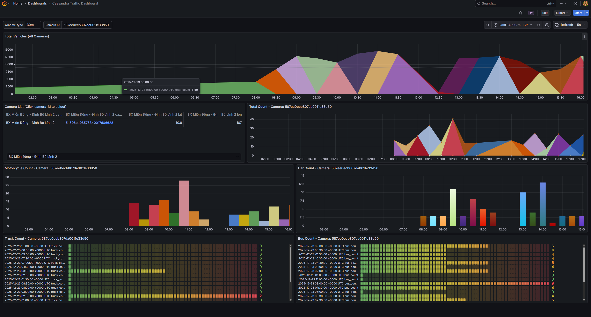

### **ʜuɠɘɗata**
> IT4931: soict - hust
---  

# Hệ thống Big Data cho Camera Giao Thông
*(Lambda-style pipeline với Kafka → HDFS → Spark Streaming & Spark Batch)*

> Mục tiêu: Xây dựng **pipeline đầu-cuối** để **thu thập – xử lý – lưu trữ – trực quan hóa** dữ liệu từ camera giao thông theo thời gian thực, từ đó tạo **insight** về ùn tắc, mật độ phương tiện,...

---
**Overview Architecture**: 
> https://www.canva.com/design/DAG3tcajdLA/1BPAGW-9S1AUOJAQAVEIEw/edit?utm_content=DAG3tcajdLA&utm_campaign=designshare&utm_medium=link2&utm_source=sharebutton  

 

**Screenshots**: 
> Batch Grafana dashboard  
  
