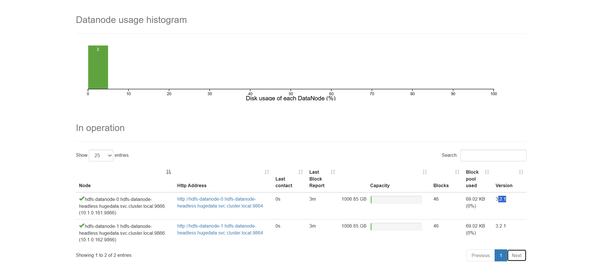

# Hướng dẫn Deploy Luồng Producer → Kafka → Spark Stream trên K8s

## 📋 Tổng quan
Hệ thống xử lý dữ liệu giao thông real-time với luồng:
```
Producer (YOLO + Kafka) → Kafka Broker → Spark Streaming → Parquet Files
```

---
## 🚀 Deployment Steps

### **Bước 1: Tạo Namespace**
```bash
kubectl apply -f k8s/namespace.yaml
```

### **Bước 2: Deploy Kafka**
```bash
kubectl apply -f k8s/kafka.yaml

# Kiểm tra Kafka đã sẵn sàng
kubectl get pods -n hugedata -l app=kafka
kubectl logs -n hugedata kafka-0 --tail=50
```

### **Bước 3: Tạo Kafka Topic**
```bash
# Exec vào Kafka pod
kubectl exec -it kafka-0 -n hugedata -- bash

# Tạo topic 'traffic'
/opt/kafka/bin/kafka-topics.sh \
  --create \
  --bootstrap-server localhost:9092 \
  --topic traffic \
  --partitions 3 \
  --replication-factor 1

# Kiểm tra topic đã tạo
/opt/kafka/bin/kafka-topics.sh \
  --list \
  --bootstrap-server localhost:9092

exit
```

### **Bước 4: Deploy Spark Streaming**
```bash
kubectl apply -f k8s/spark-deployment.yaml

# Kiểm tra Spark pod
kubectl get pods -n hugedata -l app=spark-streaming
kubectl logs -n hugedata -l app=spark-streaming --tail=100
```

### **Bước 5: Deploy Producer** (2 options)

#### **Option A: Deploy trên K8s**
```bash
# Cập nhật cameras.json vào ConfigMap trong producer-deployment.yaml
kubectl apply -f k8s/producer-deployment.yaml

# Kiểm tra producer
kubectl get pods -n hugedata -l app=kafka-producer
kubectl logs -n hugedata -l app=kafka-producer -f
```

#### **Option B: Chạy Local (recommended cho testing)**
```bash
# Cần port-forward Kafka trước
kubectl port-forward -n hugedata svc/kafka 9094:9094

# Sửa producer.py: KAFKA_BOOTSTRAP_SERVERS = 'localhost:9094'
# Trong terminal khác:
cd kafka
python producer.py
```

---

## 🔍 Verification & Monitoring

### **1. Kiểm tra messages trong Kafka**
```bash
kubectl exec -it kafka-0 -n hugedata -- bash

/opt/kafka/bin/kafka-console-consumer.sh \
  --bootstrap-server localhost:9092 \
  --topic traffic \
  --from-beginning \
  --max-messages 10
```

### **2. Kiểm tra Spark logs**
```bash
kubectl logs -n hugedata -l app=spark-streaming --tail=200 -f
```

### **3. Kiểm tra output Parquet files**
```bash
# Exec vào Spark pod
kubectl exec -it <spark-pod-name> -n hugedata -- bash

# Kiểm tra data
ls -lh /app/data/
ls -lh /app/data/checkpoint/

# Đọc Parquet files (nếu có parquet-tools)
python -c "import pyarrow.parquet as pq; print(pq.read_table('/app/data/<file>.parquet'))"
```

### **4. Monitor resource usage**
```bash
kubectl top pods -n hugedata
kubectl describe pod <pod-name> -n hugedata
```

---

## 🛠️ Troubleshooting

### **Producer không kết nối được Kafka**
```bash
# Kiểm tra Kafka service
kubectl get svc -n hugedata kafka

# Test connectivity từ producer pod
kubectl exec -it <producer-pod> -n hugedata -- nc -zv kafka.hugedata.svc.cluster.local 9092
```

### **Spark không đọc được messages**
```bash
# Kiểm tra Spark có kết nối Kafka không
kubectl logs -n hugedata <spark-pod> | grep -i kafka

# Kiểm tra schema parsing
kubectl logs -n hugedata <spark-pod> | grep -i "json\|schema\|parse"
```

\
## 📊 Data Flow Check

```bash
# Terminal 1: Producer logs
kubectl logs -n hugedata -l app=kafka-producer -f

# Terminal 2: Kafka consumer (xem messages)
kubectl exec -it kafka-0 -n hugedata -- \
  /opt/kafka/bin/kafka-console-consumer.sh \
  --bootstrap-server localhost:9092 \
  --topic traffic

# Terminal 3: Spark logs
kubectl logs -n hugedata -l app=spark-streaming -f

# Terminal 4: Check output files
watch -n 5 'kubectl exec -it <spark-pod> -n hugedata -- ls -lh /app/data/'
```

---
### **HDFS**
  

```bash 
# Apply hdfs cluster cho k8s
kubectl apply ./k8s/hdfs/hdfs-cluster.yaml 

# Kiểm tra trạng thái
kubectl get pods -n hugedata -w

# ready 1/1 Runing, chạy:
kubectl port-forward svc/hdfs-namenode -n hugedata 9870:9870
# => localhost:9870 xuất hiện 2 datanode như hình
```  

```bash
# Chạy port-forward ở kafka để producer gửi data vào
kubectl port-forward -n hugedata svc/kafka 9094:9094
```  

```bash
python ./producer/producer.py
```  
> Dữ liệu nhận được ở hdfs nếu thành công: 
root@hdfs-namenode-b85564695-kfdmb:/# hdfs dfs -ls /traffic_stream  
Found 9 items  
drwxr-xr-x   - spark supergroup          0 2025-11-04 06:08 /traffic_stream/_spark_metadata  
-rw-r--r--   3 spark supergroup       3164 2025-11-04 06:08 /traffic_stream/part-00000-239fc3cd-0386-4f39-844b-810ac5d912a1-c000.snappy.parquet  
-rw-r--r--   3 spark supergroup       3129 2025-11-04 06:07 /traffic_stream/part-00000-317aaeb3-37f9-40f1-961a-3c93a8c815d6-c000.snappy.parquet  
-rw-r--r--   3 spark supergroup       3190 2025-11-04 06:08 /traffic_stream/part-00000-3eee1b11-459b-4043-a202-5f50646e632c-c000.snappy.parquet  
-rw-r--r--   3 spark supergroup        872 2025-11-04 06:06 /traffic_stream/part-00000-4c26ac0d-a77b-4505-843a-f8d8321a6ca9-c000.snappy.parquet  
-rw-r--r--   3 spark supergroup       3178 2025-11-04 06:07 /traffic_stream/part-00000-6ccb519f-6aa8-4879-96eb-041d7a6aa0aa-c000.snappy.parquet  
-rw-r--r--   3 spark supergroup       3187 2025-11-04 06:07 /traffic_stream/part-00000-7fecc515-c3d6-47a1-b86c-13a427e090d0-c000.snappy.parquet  
-rw-r--r--   3 spark supergroup       3194 2025-11-04 06:07 /traffic_stream/part-00000-ba9a754f-3e3e-4e1a-87b0-c15af914cb0b-c000.snappy.parquet  
-rw-r--r--   3 spark supergroup       3142 2025-11-04 06:08 /traffic_stream/part-00000-dfb1bc61-ccd8-42aa-9b0e-d2b65cc818a6-c000.snappy.parquet    

## 🧹 Cleanup 

```bash
# Xóa tất cả resources
kubectl delete -f k8s/producer-deployment.yaml
kubectl delete -f k8s/spark-deployment.yaml
kubectl delete -f k8s/kafka.yaml

# Xóa PVC (data sẽ mất)
kubectl delete pvc spark-data-pvc -n hugedata

# Xóa namespace (nếu muốn)
kubectl delete namespace hugedata
```

---
